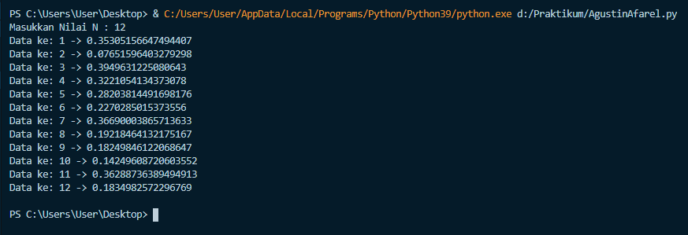
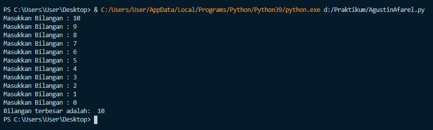
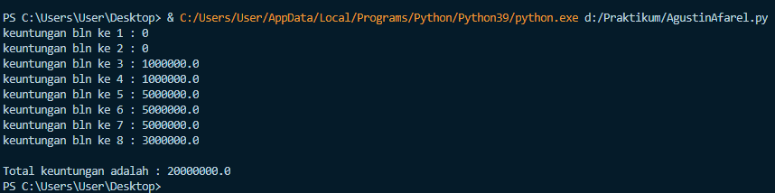

# Praktikum3-Pertemuan7
Dibuat untuk memenuhi tugas bahasa pemrograman

NAMA   : AGUSTIN AFAREL

NIM    :312010081

KELAS  :TI.20.B.1.

MATKUL :BAHASA PEMROGRAMAN

### LATIHAN 1

* Menampilkan bilangan N  yang lebih kecil dari 0.5 <br>

Input Masukan Nilai N <br>
Import random untuk membangkitkan nilai random <br>
Gunakan perulangan for disebut sebagai counted loop perulangan yang terhitung, yaitu perintah yang dieksekusi secara berulang berdasarkan jumlah perulangan tertentu<br>
Range nilai awal, nilai akhir, nilai kenaikan<br>

 
```python

 n=int(input("Masukkan Nilai N : "))

import random

for data in list(range(1, n+1, 1)):
    print(f"Data ke: {data} ->",random.uniform(0, 0.5))

print()
```


### LATIHAN 2

* Membuat program untuk menampilkan bilangan terbesar dari n buah data yang diinputkan dan memasukan angka 0 untuk berhenti.

Masukan angka1=0 <br>
gunakan perulangan while yang duisebut uncounted loop perulangan yang tak terhitung berdasarkan kondisi tertentu selama kondisi bernilai TRUE.<br>
break digunakan untuk menghentikan proses perulangan pada kondisi tertentu<br>


 ``` python
 angka1=0
while True:
    bilangan1 = int(input("Masukkan Bilangan : "))
    if (angka1 < bilangan1):
        angka1=bilangan1
    if (bilangan1 == 0):
        break

print("Bilangan terbesar adalah: ",angka1)
```



### LATIHAN 3 

* Membuat program sederhana dengan perulangan<br>
Seseorang penguasaha menginvestasikan uangaya untuk memulai usahanya dengan modal awal 100 juta, pada bulan pertama dan kedua belum mendapatkan keuntungan, pada bulan ketiga baru mulai mendapatkan keuntungan sebesar 1% dan pada bulan ke 5, pendapatan meningkat 5%, selanjutnya pada bulan ke 8 mengalami penurunan keuntungan sebesar 2% sehingga keuntungan menjadi 3%. Hitung total keuntungan selama 8 bulan berjalan usahanya.

 ```python
 uang = 100000000

for bln in range(1, 9, 1):
    # Menentukan Keuntungan pada bln ke 1 dan ke 2
    if (bln >= 1) and (bln <= 2):
        # keuntungan bln 1 dan 2 adalah 0%
        keuntungan12 = uang * 0
        print(f"keuntungan bln ke {bln} : {keuntungan12}")

    if (bln >= 3) and (bln <= 4):
        # keuntungan bln 3 dan 4 adalah 1%
        keuntungan34 = uang * 0.01
        print(f"keuntungan bln ke {bln} : {keuntungan34}")

    if (bln >= 5) and (bln <= 7):
        # Kentungan bln 5, 6, 7 adalah 5%
        Keuntungan567 = uang * 0.05
        print(f"keuntungan bln ke {bln} : {Keuntungan567}")

    if bln == 8:
        keuntungan8 = uang * 0.03
        print(f"keuntungan bln ke {bln} : {keuntungan8}")

totalkeuntungan = keuntungan12+keuntungan12+keuntungan34+keuntungan34+Keuntungan567+Keuntungan567+Keuntungan567+keuntungan8

print(f"\nTotal keuntungan adalah : {totalkeuntungan}")
```


